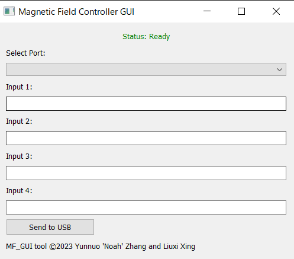

# Magnetic Field Controller GUI



A simple graphical user interface (GUI) for controlling and communicating with devices over serial ports.

## Features

- Automatically detect and list available serial ports.
- Send custom data strings over selected serial port.
- Real-time status updates.
  - Green: Data sent successfully.
  - Red: Error in data transmission.
- Easy-to-use, intuitive design.

## Installation

### Prerequisites

- Python 3.10+
- PyQt5
- pyserial

To install the necessary packages, run:

```bash
pip install PyQt5 pyserial
```

### Cloning the Repository

```bash
git clone https://github.com/YOUR_GITHUB_USERNAME/MagneticFieldControllerGUI.git
cd MagneticFieldControllerGUI
```

Replace `YOUR_GITHUB_USERNAME` with your actual GitHub username.

## Usage

```bash
python main.py
```

This will open the GUI. From there:

1. Select the desired port from the drop-down menu.
2. Input data into the provided text fields.
3. Click "Send to USB" to transmit the data over the selected port.

## Contributing

Pull requests are welcome. For major changes, please open an issue first to discuss what you would like to change.

## License

This project is licensed under the MIT License. See the `LICENSE` file for details.

